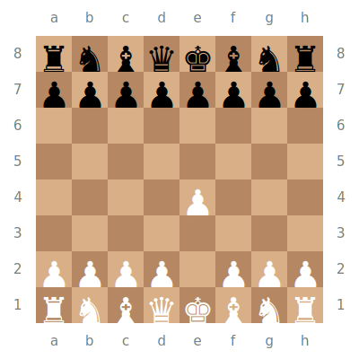

Under construction!

  
  

Available Moves

  | [a2 to a1](#) | [a2 to a1](#) | [a1 to a2](#) | [a1 to a3](#) |
  |-|-|-|-|
  | [a2 to a1](#) | [a2 to a1](#) | [a1 to a2](#) | [a1 to a3](#) |
  | [a2 to a1](#) | [a2 to a1](#) | [a1 to a2](#) | [a1 to a3](#) |
  | [a2 to a1](#) | [a2 to a1](#) | [a1 to a2](#) | [a1 to a3](#) |
  | [a2 to a1](#) | [a2 to a1](#) | [a1 to a2](#) | [a1 to a3](#) |
  | [a2 to a1](#) | [a2 to a1](#) | [a1 to a2](#) | [a1 to a3](#) |
  | [a2 to a1](#) | [a2 to a1](#) | [a1 to a2](#) | [a1 to a3](#) |
  | [a2 to a1](#) | [a2 to a1](#) | [a1 to a2](#) | [a1 to a3](#) |
  | [a2 to a1](#) | [a2 to a1](#) | [a1 to a2](#) | [a1 to a3](#) |
  | [a2 to a1](#) | [a2 to a1](#) | [a1 to a2](#) | [a1 to a3](#) |

